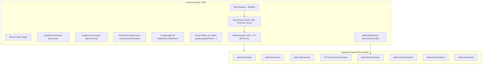

# Plano de Implementação: Frontend Angular Moderno (Signals + Tailwind + DaisyUI)

Construção de uma aplicação frontend moderna na pasta `frontend/`, utilizando a versão mais recente do **Angular (Standalone Components, Signals reativos, Zoneless/OnPush)**, estilizada com **Tailwind CSS e DaisyUI**, integrada integralmente à API RESTful e eventos em tempo real do **DOC_Intelligence**.

---

## 1. Visão Geral da Arquitetura



---

## 2. Decisões de Design Alinhadas no Grill-me

* **Framework & Reatividade:** Angular moderno (v19+) com Standalone Components, controle de fluxo `@if`, `@for`, `@switch`, Signals nativos (`signal`, `computed`, `effect`, `linkedSignal`) e arquitetura sem dependências pesadas de terceiros (sem NgRx clássico).
* **UI & Estilização:** Tailwind CSS com DaisyUI (paleta corporate/dark, botões, modais, badges de status, inputs com feedback, toasts flutuantes).
* **Conferência Humana Lado a Lado:** Visão dividida em tela cheia (Split-Screen) com visualizador de imagem (zoom, pan, rotação) à esquerda e painel de auditoria, troca de template (ex: `RG_ANTIGO` $\to$ `CIN`), correção de campos e aprovação/rejeição à direita.
* **Portal Público do Cliente (Mobile-First / Envio Guiado):** Rota desautenticada `/public/upload?token=...` desenvolvida com foco total em experiência mobile para o usuário final:
  * **Seleção de Documentos por Cards Ilustrativos:** Consulta os templates disponíveis do backend e renderiza cards visuais com ícones representativos (CIN, RG Tradicional, etc.).
  * **Modos de Captura Flexíveis:** Escolha entre anexar arquivos existentes no dispositivo (PDF/PNG/JPEG) ou abrir a câmera diretamente do celular.
  * **Interface de Câmera com Guias de Enquadramento (Viewfinder Overlay):** Retângulo delimitador com cantoneiras visuais para alinhamento correto do documento, correção de ângulo e aviso de reflexos antes da captura em alta resolução via Canvas.
  * **Staging de Itens Anexados:** Lista com miniaturas dos documentos adicionados até o momento, permitindo adicionar mais páginas/documentos ou remover antes do envio.
  * **Confirmação e Notificação de Sucesso:** Feedback claro de envio com tela de confirmação de recebimento e processamento.
* **Notificações SSE & Toasts:** Conexão permanente com `GET /api/v1/events/stream`, atualizando o sino da navbar com badge numérico, menu dropdown com histórico recente e toasts flutuantes com auto-dismiss.

---

## 3. Estrutura de Diretórios Proposta

```text
frontend/
├── src/
│   ├── app/
│   │   ├── core/
│   │   │   ├── guards/
│   │   │   │   └── auth.guard.ts             # Proteção de rotas autenticadas
│   │   │   ├── interceptors/
│   │   │   │   ├── auth.interceptor.ts       # Injeção de Bearer Token
│   │   │   │   └── error.interceptor.ts      # Mapeamento semântico de erros da API
│   │   │   ├── models/
│   │   │   │   ├── auth.model.ts             # Tipos de User, Login, Token
│   │   │   │   ├── persona.model.ts          # Persona, PersonaStatus, Onboarding
│   │   │   │   ├── document.model.ts         # Document, ExtractedFields, Review
│   │   │   │   ├── template.model.ts         # Templates cadastrados (CIN, RG, etc.)
│   │   │   │   ├── webhook.model.ts          # WebhookConfig, WebhookEvent
│   │   │   │   └── notification.model.ts     # SSE events, ToastItem
│   │   │   └── services/
│   │   │       ├── auth.service.ts           # Signal Store de autenticação
│   │   │       ├── persona.service.ts        # Signal Store & API de Personas
│   │   │       ├── document.service.ts       # Signal Store & API de Documentos
│   │   │       ├── template.service.ts       # Consulta de Templates
│   │   │       ├── webhook.service.ts        # Gestão de Webhooks
│   │   │       ├── notification.service.ts   # Cliente EventSource SSE + Histórico
│   │   │       └── toast.service.ts          # Gerenciador global de Toasts
│   │   ├── layout/
│   │   │   ├── shell.component.ts            # Layout principal (Sidebar + Navbar)
│   │   │   ├── navbar.component.ts           # Barra superior, sino SSE, perfil
│   │   │   ├── sidebar.component.ts          # Menu de navegação lateral DaisyUI
│   │   │   └── toast-container.component.ts  # Renderizador de Toasts DaisyUI
│   │   └── features/
│   │       ├── auth/
│   │       │   └── login.component.ts        # Tela de login limpa e responsiva
│   │       ├── personas/
│   │       │   ├── persona-list.component.ts # Tabela, busca, filtros, paginação, modal nova persona
│   │       │   └── persona-detail.component.ts # Info da persona, documentos, modal link de coleta
│   │       ├── conference/
│   │       │   └── document-review.component.ts # Split-screen lado a lado com zoom/pan e troca de template
│   │       ├── webhooks/
│   │       │   └── webhook-list.component.ts # Lista e cadastro de webhooks com testes de entrega
│   │       └── public/
│   │           ├── public-upload.component.ts # Orquestrador do portal público de envio
│   │           ├── camera-modal.component.ts  # Modal de câmera com viewfinder, cantoneiras e captura canvas
│   │           ├── template-card.component.ts # Cards ilustrativos para escolha do tipo de documento
│   │           └── staged-docs.component.ts   # Galeria de miniaturas de documentos prontos para envio
│   ├── app.config.ts                         # Configuração Angular (Providers, Interceptors, Routes)
│   ├── app.routes.ts                         # Definição das rotas Standalone
│   └── styles.css                            # Importação Tailwind CSS e DaisyUI
├── tailwind.config.js                        # Configuração Tailwind e DaisyUI
└── package.json
```

---

## 4. Plano Passo a Passo de Execução

### Fase 1: Inicialização do Projeto e Configuração de Estilização
* Gerar a aplicação Angular Standalone em `frontend/` com `@angular/cli`.
* Instalar e configurar Tailwind CSS, `@tailwindcss/typography` e `daisyui`.
* Configurar variáveis de ambiente (`environments/environment.ts`) apontando para `http://localhost:8000/api/v1`.

### Fase 2: Camada Core, Tipagens TypeScript e Interceptors
* Implementar modelos completos com Utility Types (`Pick`, `Omit`, `Partial`, `Record`, etc.).
* Implementar `AuthService` com Signals (`currentUser`, `token`, `isAuthenticated`, `isAdmin`).
* Implementar `auth.interceptor.ts` e `error.interceptor.ts` (capturando mensagens em PT-BR retornadas pelo FastAPI e exibindo Toasts).
* Implementar `ToastService` e `NotificationService` (SSE listener com reconexão automática e parse dos eventos `document.processing`, `document.ready`, `document.needs_review`, `persona.completed`).

### Fase 3: Layout Base e Autenticação
* Criar componentes de layout: `ShellComponent`, `SidebarComponent`, `NavbarComponent` (com sino e dropdown de notificações) e `ToastContainerComponent`.
* Criar tela de login (`LoginComponent`) com integração completa a `POST /auth/login`, feedback de carregamento e redirecionamento seguro.

### Fase 4: Gestão de Personas e Links de Coleta
* Tela `PersonaListComponent`:
  * Busca por nome, email ou CPF com debounce.
  * Filtro por status (`PENDING`, `DOCUMENTS_RECEIVED`, `IN_REVIEW`, `ONBOARDING_COMPLETED`).
  * Modal DaisyUI para cadastrar Nova Persona com seleção de documentos obrigatórios (`["CIN"]`).
  * Botão de exclusão definitiva com confirmação (**RN-13 Direito ao Esquecimento**).
* Tela `PersonaDetailComponent`:
  * Resumo do onboarding da Persona e progresso.
  * Tabela de documentos enviados com status, badges de confiança e pré-visualização.
  * Modal para gerar Link de Coleta Público de 48h (**RN-12**) com botão de cópia rápida para a área de transferência.

### Fase 5: Tela de Conferência Humana Split-Screen (RN-10)
* Tela `DocumentReviewComponent`:
  * Adquire e mantém o Lock pessimista de 10 minutos (`POST /documents/:id/lock` - **RN-08**).
  * Painel Esquerdo: Canvas interativo com zoom (scroll do mouse ou botões `+`/`-`), pan (arrastar com mouse), rotação de 90° e botão para abrir em nova aba.
  * Painel Direito:
    * Seletor dinâmico de template (`CIN`, `RG_ANTIGO`, `CNH`), permitindo reclassificar documentos inferidos erroneamente.
    * Campos editáveis preenchidos com os dados extraídos pelo backend.
    * Alertas visuais e indicadores de confiança por campo.
    * Ação de "Aprovar Conferência (RN-10)": envia `PUT /documents/:id/review` limpando pendências e atualizando o status para `READY`.
    * Ação de "Rejeitar por Ilegibilidade (RN-09)": envia `POST /documents/:id/reject` solicitando reenvio.

### Fase 6: Gestão de Webhooks e Portal do Cliente Guiado (Mobile-First)
* Tela `WebhookListComponent`: Cadastro de endpoints HTTP para disparo de eventos em tempo real com seleção de tópicos e chave secreta.
* Portal Público do Cliente (`PublicUploadComponent`):
  * Validação do token na URL e exibição do nome do titular e documentos solicitados.
  * **Seleção por Cards:** Grade de cards com ícones representativos para escolher o documento a enviar (CIN Frente/Verso, RG, etc.).
  * **Opção de Anexar ou Câmera:** Botão para escolher foto/PDF do dispositivo ou acionar a câmera ao vivo.
  * **Viewfinder de Câmera com Guias de Enquadramento (`CameraModalComponent`):** Abre a câmera traseira do celular (`getUserMedia` com `facingMode: environment`) com retângulo delimitador, cantoneiras em destaque e dicas visuais para evitar reflexos e garantir o ângulo correto. Captura no Canvas gerando arquivo JPEG de alta qualidade.
  * **Galeria de Staging (`StagedDocsComponent`):** Exibe os documentos capturados até o momento em miniaturas, permitindo remover itens ou adicionar novas capturas.
  * **Envio & Confirmação:** Envio em lote para a API com barra de progresso e tela de confirmação com animação e mensagem de sucesso.

---

## 5. Plano de Verificação

### Testes Automatizados
* Executar `npm test` no frontend para validar os componentes e serviços com Signals.
* Executar a suíte de testes existente do backend (`pytest tests -v`) para garantir que os contratos da API permaneçam 100% íntegros.

### Validação Manual de Fluxos de Ponta a Ponta
1. **Fluxo de Login & Sessão:** Login com `admin@docintelligence.com` / `adminpassword123`, armazenamento do token, verificação do sino com SSE ativo e logout.
2. **Fluxo de Persona & Link de Coleta:** Criar uma nova persona, gerar um link de coleta público e copiar a URL.
3. **Fluxo Público de Envio:** Abrir a página `/public/upload?token=...`, enviar uma imagem de documento (CIN) e observar a notificação SSE disparada em tempo real no sino da navbar do operador.
4. **Fluxo de Conferência Lado a Lado:** Abrir o documento na fila de conferência, alterar o template se necessário, corrigir campos, aprovar e verificar se a Persona atinge `ONBOARDING_COMPLETED`.
