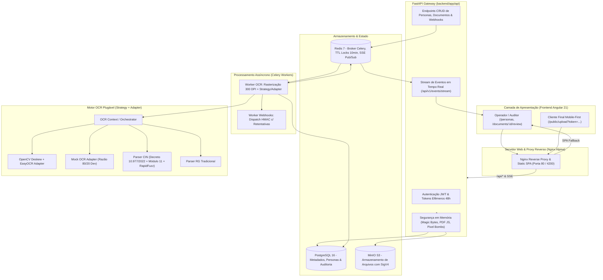

# 📄 DOC_Intelligence - Plataforma de Inteligência Documental e OCR

Plataforma completa de extração, processamento, validação e auditoria de documentos de identidade brasileiros (com foco na **Nova Carteira de Identidade Nacional - CIN** e **RG Tradicional**), com validação matemática de CPF por Módulo 11, correção ortográfica fonética/fuzzy, mensageria assíncrona, armazenamento particionado MinIO S3 SigV4, conferência humana *Split-Screen* com locking pessimista, portal do cliente com câmera guiada e eventos em tempo real via Server-Sent Events (SSE).

---

## 📑 Sumário

1. [Visão Geral da Arquitetura](#1-visão-geral-da-arquitetura)
2. [Documentos Fundamentais e Planos do Projeto](#2-documentos-fundamentais-e-planos-do-projeto)
3. [Mapeamento e Organização do Repositório](#3-mapeamento-e-organização-do-repositório)
4. [Execução e Deploy com Docker](#4-execução-e-deploy-com-docker)
   - [Deploy em Produção (Full Stack)](#41-deploy-em-produção-full-stack)
   - [Ambiente de Desenvolvimento (Dev com Hot-Reload)](#42-ambiente-de-desenvolvimento-dev-com-hot-reload)
   - [Execução Local sem Docker](#43-execução-local-sem-docker)
5. [Endpoints, Portas e Credenciais Padrão](#5-endpoints-portas-e-credenciais-padrão)
6. [Regras de Negócio Implementadas (RN-01 a RN-15)](#6-regras-de-negócio-implementadas-rn-01-a-rn-15)
7. [Qualidade e Testes Automatizados](#7-qualidade-e-testes-automatizados)
8. [Governança Git Flow e Releases](#8-governança-git-flow-e-releases)
9. [O Projeto e Decisões de Arquitetura (ADR)](#9-o-projeto-e-decisões-de-arquitetura-adr)

---

## 1. Visão Geral da Arquitetura

O sistema é dividido em duas aplicações principais integradas por APIs RESTful e streaming SSE:



---

## 2. Documentos Fundamentais e Planos do Projeto

O desenvolvimento do sistema seguiu rigorosamente os planos e documentos conceituais versionados no repositório:

| Documento / Ferramenta | Função / Descrição |
| :--- | :--- |
| [`O_projeto.md`](./O_projeto.md) | **O Projeto e Decisões Iniciais (ADR)**: Registro formal da concepção, motivação do problema, pesquisa preliminar (Deep Research), trade-offs, descarte de VLMs e justificativa da stack. |
| [`PLANO_DE_IMPLEMENTACAO_BACKEND.md`](./PLANO_DE_IMPLEMENTACAO_BACKEND.md) | **Plano Mestre do Backend**: Arquitetura em camadas, regras RN-01 a RN-15, Strategy + Adapter, schemas Pydantic v2, Celery e MinIO S3. |
| [`PLANO_DE_IMPLEMENTACAO_FROTEND.md`](./PLANO_DE_IMPLEMENTACAO_FROTEND.md) | **Plano Mestre do Frontend**: Arquitetura Angular 21 Standalone, Signal Stores, DaisyUI, tela de conferência Split-Screen e portal mobile de upload. |
| [`gerar-cin/README.md`](./gerar-cin/README.md) | **Gerador de Amostras de CIN**: Ferramenta visual client-side (100% offline) para gerar imagens e PDFs realistas da CIN com CPF válido (Módulo 11) para testes de OCR. |
| [`regras_negocio.md`](./regras_negocio.md) | **15 Regras de Negócio (RN-01 a RN-15)**: Especificação formal de limiares de confiança, Módulo 11, locking pessimista e LGPD. |
| [`Especificacao_Casos_de_Uso.md`](./Especificacao_Casos_de_Uso.md) | **Casos de Uso Detalhados**: Atores do sistema (Operador vs. Cliente), fluxos principais, alternativos e de exceção. |
| [`Requisitos_de_Sistema.md`](./Requisitos_de_Sistema.md) | **Requisitos Funcionais e Não-Funcionais**: Requisitos de performance, concorrência, segurança e compatibilidade. |
| [`REGISTRO_USO_IA.md`](./REGISTRO_USO_IA.md) | **Governança de IA & Auditoria**: Registro formal de uso de agentes de IA, inventário de skills e análise crítica de erros/correções. |
| [`prompts/README.md`](./prompts/README.md) | **Catálogo de Prompts**: Histórico cronológico de todos os prompts fornecidos durante o projeto, incluindo prompts de pesquisa (`prompts/pesquisa/`). |

---

## 3. Mapeamento e Organização do Repositório

```text
DOC_Intelligence/
├── docker-compose.yml              # Orquestrador de Produção (Full Stack com Nginx)
├── docker-compose.dev.yml          # Orquestrador de Desenvolvimento (Hot-reload API)
├── PLANO_DE_IMPLEMENTACAO_BACKEND.md # Especificação arquitetural e plano de execução do backend
├── PLANO_DE_IMPLEMENTACAO_FROTEND.md # Especificação arquitetural e plano de execução do frontend
├── regras_negocio.md               # Especificação das 15 regras de negócio (RN-01 a RN-15)
├── REGISTRO_USO_IA.md              # Relatório de governança e auditoria de agentes de IA
├── prompts/                        # Histórico cronológico dos prompts executados
│   ├── pesquisa/                   # Prompts de Deep Research e elicitação de requisitos
│   └── README.md                   # Índice e tabela de rastreabilidade de prompts
│
├── gerar-cin/                      # Gerador visual offline de amostras sintéticas de CIN para testes
│   ├── index.html                  # Interface gráfica (duplo clique para abrir no navegador)
│   ├── assets.js                   # Templates embutidos em Base64
│   ├── img (1).jfif / img (2).jfif # Imagens base de alta definição (Frente e Verso)
│   └── README.md                   # Instruções de uso e casos de teste do gerador
│
├── backend/                        # API RESTful, Processamento OCR e Filas Assíncronas
│   ├── Dockerfile                  # Imagem Docker multi-stage para API e Celery Worker
│   ├── pyproject.toml              # Dependências e gerenciador de pacotes Python
│   ├── app/
│   │   ├── api/
│   │   │   ├── deps.py             # Injeção de dependências (JWT, DB, Redis, Roles)
│   │   │   └── v1/
│   │   │       ├── endpoints/      # Endpoints REST (auth, personas, documents, sse, etc.)
│   │   │       └── router.py       # Agregador de rotas v1
│   │   ├── core/
│   │   │   ├── config.py           # Configurações com Pydantic Settings (.env)
│   │   │   ├── security.py         # Criptografia, JWT e Tokens Efêmeros
│   │   │   ├── file_security.py    # Validação multicamada em memória (Magic Bytes, PDF JS)
│   │   │   └── logging.py          # Logger estruturado com mascaramento de PII (RN-14)
│   │   ├── db/                     # Conexão assíncrona SQLAlchemy 2.0 e Base declarativa
│   │   ├── models/                 # Modelos ORM (User, Persona, Document, Template, Webhook)
│   │   ├── schemas/                # Schemas Pydantic v2 de validação e serialização
│   │   ├── services/
│   │   │   ├── ocr/                # Strategy Pattern (EasyOCR, MockOCR, Parsers CIN/RG)
│   │   │   ├── storage/            # Cliente MinIO S3 com SigV4 e Máscara Customizável
│   │   │   ├── locking.py          # Locks Pessimistas no Redis com TTL de 10 min (RN-07/08)
│   │   │   ├── sse_service.py      # Pub/Sub SSE em tempo real
│   │   │   └── persona_service.py  # Completude (RN-15) e Cascade Hard Delete (RN-13)
│   │   └── workers/                # Instância Celery e Tasks assíncronas (OCR, Webhooks)
│   └── tests/                      # 32 testes de integração automatizados em Pytest
│
└── frontend/                       # Aplicação Single Page Application (SPA)
    ├── Dockerfile                  # Build multi-stage (Node 22 build -> Nginx Alpine runtime)
    ├── nginx.conf                  # Servidor Web com fallback SPA, Gzip, SSE e Proxy Reverso
    ├── angular.json                # Configuração Angular 21 e substituição de ambientes
    ├── src/
    │   ├── environments/           # Configuração de ambientes (Prod: /api/v1 | Dev: localhost:8000)
    │   ├── styles.css              # Importação do Tailwind CSS v4 e DaisyUI v5
    │   └── app/
    │       ├── core/               # Models TypeScript, Signal Stores, Services e Interceptors
    │       ├── layout/             # Shell, Sidebar, Navbar com sino SSE e Container de Toasts
    │       └── features/           # Módulos funcionais da aplicação:
    │           ├── auth/           # Tela de Login com atalho de credenciais
    │           ├── personas/       # Listagem, criação e detalhes de titulares
    │           ├── conference/     # Tela Split-Screen de Conferência Humana (RN-10)
    │           ├── public/         # Portal Mobile com Câmera Guiada e Staging de Documentos
    │           └── webhooks/       # Gestão de endpoints e logs de entrega de webhooks
```

---

## 4. Execução e Deploy com Docker

### 4.1. Deploy em Produção (Full Stack)

Para inicializar todo o ecossistema (PostgreSQL, Redis, MinIO S3, API FastAPI, Celery Worker e Frontend Nginx) com um único comando na raiz do projeto:

```bash
docker compose up -d --build
```

O comando irá:
1. Compilar o frontend Angular 21 em modo otimizado e encapsular no Nginx.
2. Construir a imagem Python com OpenCV, EasyOCR e PyTorch.
3. Subir o banco PostgreSQL 16 e executar as migrações automáticas.
4. Inicializar o MinIO S3 e criar automaticamente o bucket `doc-intelligence-storage`.
5. Iniciar os Celery Workers para OCR assíncrono.

---

### 4.2. Ambiente de Desenvolvimento (Dev com Hot-Reload)

Para rodar a infraestrutura e backend em modo de desenvolvimento (com hot-reload de código ativo):

```bash
# 1. Iniciar os serviços de suporte e API com reload
docker compose -f docker-compose.dev.yml up -d

# 2. Iniciar o frontend em modo de desenvolvimento local
cd frontend
npm install
npm start
```

---

### 4.3. Execução Local sem Docker

Caso prefira rodar os serviços individualmente na sua máquina:

#### Backend:
```bash
cd backend
python -m venv .venv
source .venv/bin/activate  # No Windows: .venv\Scripts\activate
pip install -e .

# Iniciar FastAPI
uvicorn app.main:app --host 0.0.0.0 --port 8000 --reload

# Iniciar Celery Worker (em outro terminal)
celery -A app.workers.celery_app.celery_app worker --loglevel=info -Q default,ocr,webhooks
```

#### Frontend:
```bash
cd frontend
npm install
npm start
```

---

## 5. Endpoints, Portas e Credenciais Padrão

| Serviço / Interface | URL de Acesso | Descrição |
| :--- | :--- | :--- |
| **Frontend SPA (Nginx / Prod)** | [`http://localhost`](http://localhost) ou [`http://localhost:4200`](http://localhost:4200) | Aplicação web para operadores e clientes. |
| **Acesso na Rede Local (LAN / Wi-Fi)** | `http://<IP_DO_COMPUTADOR>` ou `http://<IP_DO_COMPUTADOR>:4200` | Acesso por celulares, tablets e outros PCs na mesma rede. |
| **Swagger API Docs (FastAPI)** | [`http://localhost:8000/docs`](http://localhost:8000/docs) ou [`http://localhost/docs`](http://localhost/docs) | Documentação interativa da API OpenAPI v3. |
| **Stream de Eventos SSE** | `http://localhost:8000/api/v1/events/stream` | Canal de eventos em tempo real Server-Sent Events. |
| **MinIO S3 Console** | [`http://localhost:9001`](http://localhost:9001) | Console de gestão visual do bucket de armazenamento. |
| **MinIO S3 API Endpoint** | `http://localhost:9000` | Endpoint de upload e download SigV4 S3. |

### 🌐 Acesso por Dispositivos na Mesma Rede (Smartphones / Tablets / Outros PCs):
Para acessar o frontend ou abrir links de coleta pública a partir de celulares e outros dispositivos conectados no mesmo Wi-Fi/rede local:
1. Descubra o IP local do computador onde o Docker está rodando:
   * **Windows (PowerShell):** `ipconfig` (procure pelo campo *IPv4 Address*, ex: `192.168.1.50`).
   * **Linux/Mac:** `ip a` ou `ifconfig`.
2. No navegador do dispositivo móvel/rede local, acerte:
   * **Frontend:** `http://<SEU_IP_LOCAL>` (ex: `http://192.168.1.50`)
   * **Porta Alternativa:** `http://<SEU_IP_LOCAL>:4200`
3. Os links de coleta gerados pelo operador (`/public/upload?token=...`) utilizarão automaticamente a origem e o IP da rede local.
4. *(Opcional)* Se o Windows Defender Firewall bloquear conexões de outros aparelhos, libere a porta 80/4200 com:
   ```powershell
   New-NetFirewallRule -DisplayName "DOC_Intelligence_Prod" -Direction Inbound -LocalPort 80,4200 -Protocol TCP -Action Allow
   ```

### 🔐 Credenciais Padrão de Acesso:
* **Usuário Operador / Administrador:** `admin@docintelligence.com` / `adminpassword123`
* **MinIO Console (S3):** `minioadmin` / `minioadmin`
* **PostgreSQL:** `postgres` / `postgres` (Banco: `doc_intelligence`)

---

## 6. Regras de Negócio Implementadas (RN-01 a RN-15)

O sistema cumpre integralmente as 15 regras de negócio:

* **RN-01 (Limiar de Confiança):** Requer $\ge 85\%$ em cada campo obrigatório. Campos abaixo do limiar direcionam o documento para `NEEDS_REVIEW`.
* **RN-02 (Dedução de Template):** Classificação automática com limiar de $\ge 90\%$. Score inferior encaminha para a fila de conferência.
* **RN-03 (Fuzzy Matching):** Correção ortográfica de municípios com base na tabela do IBGE para similaridades entre 80% e 99% via RapidFuzz.
* **RN-04 (Módulo 11 do CPF):** Validação matemática estrita do CPF. CPFs inválidos forçam revisão manual imediata.
* **RN-05 (Conformidade CIN vs. RG):** A CIN não exige RG estadual nem filiação frontal; o CPF é a chave única nacional (Decreto nº 10.977/2022).
* **RN-06 (Rasterização 300 DPI):** PDFs multipágina são renderizados com `pypdfium2` fixados em 300 DPI para precisão de microletras.
* **RN-07 e RN-08 (Locking Pessimista):** Bloqueio de 10 minutos (600s) no Redis por documento durante a análise humana, retornando HTTP 409 em conflitos.
* **RN-09 (Rejeição de Qualidade):** Registro de motivo para imagens ilegíveis/cortadas com notificação para novo upload.
* **RN-10 (Imutabilidade e Reclassificação):** Documentos aprovados tornam-se imutáveis para operadores; na conferência é possível trocar o template do documento.
* **RN-11 e RN-12 (Link de Coleta 48h):** Links públicos efêmeros com validade de 48h para envio de documentos sem autenticação de operador.
* **RN-13 (Direito ao Esquecimento - LGPD):** Exclusão em cascata (*Hard Delete*) no PostgreSQL e MinIO ao deletar uma Persona.
* **RN-14 (Privacidade nos Logs):** Mascaramento obrigatório de dados sensíveis (PII como CPF, nomes e filiação) nos logs do sistema.
* **RN-15 (Completude da Persona):** Transição automática para o status `ONBOARDING_COMPLETED` quando todos os documentos da lista estão no status `READY`.

---

## 7. Qualidade e Testes Automatizados

### 🧪 Executar Testes do Backend (Pytest):
```bash
cd backend
pytest tests -v
# 32 passed in 4.33s (100% de sucesso)
```

### 🧪 Executar Testes do Frontend (Vitest):
```bash
cd frontend
npm test
# Test Files 1 passed | Tests 1 passed
```

### 📦 Testes Manuais via Postman:
O diretório `backend/` disponibiliza a coleção completa [`postman_collection.json`](file:///d:/DOC_Intelligence/backend/postman_collection.json) e o ambiente [`postman_environment.json`](file:///d:/DOC_Intelligence/backend/postman_environment.json) com variáveis configuradas para testar todo o ciclo de vida dos endpoints.

### 🪪 Geração de Amostras Sintéticas da CIN para Testes (`gerar-cin`):
Para gerar imagens e PDFs de teste com dados brasileiros realistas (frente, verso e QR Code):
1. Acesse a pasta [`gerar-cin/`](./gerar-cin/).
2. Abra o arquivo [`index.html`](./gerar-cin/index.html) diretamente no navegador (não requer servidor).
3. Selecione a quantidade (1 a 50), formato (PNG/JPG/PDF) e resolução (1x, 2x HD, 3x Full HD).
4. Baixe os arquivos individuais ou o pacote `.ZIP` / PDF único e utilize nos endpoints de upload ou no portal mobile.

---

## 8. Governança Git Flow e Releases

O repositório é gerenciado através do fluxo **Git Flow**:
* **`main`:** Branch principal de produção estável, contendo as tags:
  * **`v1.0.0`**: Backend MVP (FastAPI, OCR Plugável, MinIO SigV4, Celery, Redis, 32 testes e Postman).
  * **`v1.1.0`**: Frontend SPA Angular 21 (Signals, DaisyUI, Conferência Split-Screen, Câmera Guiada Mobile, Dockerfile e Governança de IA).
* **`develop`:** Branch ativa de integração contínua.
* **Branches de Feature:** Mescladas exclusivamente com *merge commits* semânticos (`--no-ff`).

---

## 9. O Projeto e Decisões de Arquitetura (ADR)

O documento integral de especificação inicial, motivação do problema, pesquisa e registro formal das decisões arquiteturais encontra-se em [`O_projeto.md`](./O_projeto.md).

### 💡 Síntese das Decisões e Justificativas:

1. **Problemática e Complexidade do OCR**:
   * Diferente de problemas convencionais de OCR (como cupons fiscais padronizados), documentos de identidade (CIN, RG, CNH) possuem ruídos, texturas de segurança, carimbos, orientação variável e diferentes padrões estaduais.
   * Foi realizada uma pesquisa preliminar aprofundada (*Deep Research*) documentada em [`prompts/pesquisa/`](./prompts/pesquisa/) para avaliar o estado da arte de motores abertos e pipelines híbridos.

2. **Abordagem de OCR e Padrões Strategy / Adapter**:
   * **Escolha**: Combinação de **EasyOCR** com filtros de visão computacional em **OpenCV** (deskew, rotação, normalização espacial e binarização adaptativa).
   * **Descarte de VLMs (ex.: Qwen2.5-VL)**: Descartados por demandarem hardware com GPU dedicada de alta performance e alto custo computacional, inviabilizando a execução leve em CPU ou servidores locais comuns.
   * **Padrões de Projeto**: Uso de **Strategy** e **Adapter** para isolar o motor de OCR, tornando o pipeline modular e *plug-and-play* para alternar motores sem afetar as regras de negócio.

3. **Justificativa da Stack Tecnológica**:
   * **Python 3.11 + FastAPI**: Ecossistema de ponta para visão computacional, APIs assíncronas de alta performance e tipagem rigorosa via Pydantic v2.
   * **Celery + Redis**: Fila assíncrona indispensável para desacoplar o processamento pesado de OCR das requisições HTTP e garantir mensageria SSE em tempo real.
   * **PostgreSQL 16**: Banco relacional robusto com conformidade transacional ACID, auditoria e tipos estruturados (JSONB).
   * **MinIO S3**: Armazenamento de objetos seguro com assinatura SigV4, eliminando a má prática de salvar imagens em Base64 no banco relacional.
   * **Angular 21 + Tailwind + DaisyUI**: Framework SPA tipado e reativo com Signals, OnPush e produtividade máxima na construção de UI moderna.

4. **Modelo de Domínio e Fluxo**:
   * Criação da entidade **Persona** como titular central dos documentos.
   * Coleta pública via link temporário com token assinado e câmera com retícula de enquadramento.
   * Extração assíncrona com bifurcação: aprovação automática (*auto-approval* para documentos de alta confiança) vs. conferência humana (*human-in-the-loop* com locking pessimista para documentos com pendências).

---

*DOC_Intelligence © 2026 - Desenvolvido com Engenharia Dirigida por Regras e Agentes Autônomos de IA.*
