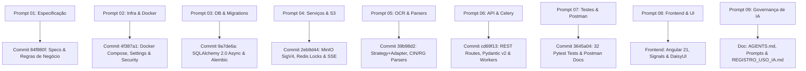

# 🤖 Registro de Uso de Inteligência Artificial e Governança de Agentes

> **Repositório:** `DOC_Intelligence`  
> **Data de Emissão:** 01 de Setembro de 2026  
> **Frameworks & Agentes Utilizados:** Antigravity 2.0 / Gemini 3.7 Flash / Claude Code Agentic Tooling  
> **Status de Governança:** ✅ Conforme com as Diretrizes de Auditoria e Transparência  

---

## 📑 Sumário Executivo

1. [Declaração Formal de Uso de IA](#1-declaração-formal-de-uso-de-ia)
2. [Arquivos de Instrução e Governança do Repositório](#2-arquivos-de-instrução-e-governança-do-repositório)
3. [Inventário Completo de Skills, Subagentes e Ferramentas](#3-inventário-completo-de-skills-subagentes-e-ferramentas)
4. [Registro Integral e Cronológico de Prompts](#4-registro-integral-e-cronológico-de-prompts)
5. [Análise Crítica: Erros do Agente, Diagnóstico e Ações Corretivas](#5-análise-crítica-erros-do-agente-diagnóstico-e-ações-corretivas)
6. [Conclusão e Práticas de Engenharia com Agentes](#6-conclusão-e-práticas-de-engenharia-com-agentes)

---

## 1. Declaração Formal de Uso de IA

Declaramos para os devidos fins de transparência, reprodutibilidade e governança técnica que o desenvolvimento do projeto **DOC_Intelligence** utilizou **agentes autônomos de Inteligência Artificial de forma integral e estruturada** ao longo de todo o seu ciclo de vida — abrangendo concepção arquitetural, modelagem de dados, implementação de regras de negócio brasileiras, motor de OCR, APIs RESTful, mensageria assíncrona, testes automatizados e frontend reativo.

O uso de agentes seguiu o paradigma de **Engenharia Dirigida por Regras e Padrões (Rules & Skills-driven Development)**, onde o agente opera sob restrições estritas de arquitetura (Strategy + Adapter, Inversão de Dependência, Clean Architecture) e conformidade legal/regulatória (Decreto nº 10.977/2022 da Carteira de Identidade Nacional - CIN, e LGPD - Lei nº 13.709/2018).

---

## 2. Arquivos de Instrução e Governança do Repositório

Todos os arquivos de diretrizes, instruções de comportamento do agente e configurações de ecossistema estão versionados na raiz e diretórios de configuração do repositório:

| Arquivo / Diretório | Função / Propósito no Projeto |
| :--- | :--- |
| [`AGENTS.md`](file:///d:/DOC_Intelligence/AGENTS.md) | **Instruções Principais do Agente**: Define a arquitetura do sistema, padrões obrigatórios (Strategy + Adapter para OCR), regras de negócio (RN-01 a RN-15) e padrões de codificação. |
| [`.agents/skills/`](file:///d:/DOC_Intelligence/.agents/skills) | **Diretório de Skills Especializadas**: Conjunto de habilidades ativadas sob demanda para FastAPI, SQLAlchemy 2.0, PostgreSQL, Celery/Redis, EasyOCR, Angular Signals e DaisyUI. |
| [`.claude/skills/`](file:///d:/DOC_Intelligence/.claude/skills) | **Espelhamento de Skills para Claude Code / CLI**: Garante portabilidade entre diferentes runners de agentes. |
| [`skills-lock.json`](file:///d:/DOC_Intelligence/skills-lock.json) | **Lockfile de Skills**: Mapeamento imutável de hashes criptográficos (SHA-256) e fontes upstream das skills de agente instaladas. |
| [`prompts/`](file:///d:/DOC_Intelligence/prompts) | **Diretório de Prompts na Íntegra**: Armazena os prompts raw em ordem cronológica de execução. |

---

## 3. Inventário Completo de Skills, Subagentes e Ferramentas

O repositório conta com **20 skills** e ferramentas versionadas e vinculadas aos agentes, garantindo que tarefas de diferentes especialidades sigam padrões de excelência:

| Skill | Escopo de Atuação | Fonte Upstream | Hash de Integridade |
| :--- | :--- | :--- | :--- |
| `fastapi-pro` | Padrões avançados de FastAPI, injeção de dependência e Pydantic v2 | `rmyndharis/antigravity-skills` | `7d013746...` |
| `fastapi-patterns` | Boas práticas de arquitetura em camadas e autenticação JWT | Local / Repository | Versionado em `.agents` |
| `fastapi-python` | Desenvolvimento assíncrono e tipagem estrita Python | Local / Repository | Versionado em `.agents` |
| `sqlalchemy-postgres` | Modelagem declarativa SQLAlchemy 2.0 Async e sessões `asyncpg` | `cfircoo/claude-code-toolkit` | `6917c10f...` |
| `postgresql-table-design` | Otimização de DDL, índices, constraints e tipos nativos Postgres | `wshobson/agents` | `d7d040ee...` |
| `ocr-fastapi` | Guia de arquitetura Strategy + Adapter para múltiplos motores OCR | Local / Repository | Versionado em `.agents` |
| `python-background-jobs`| Filas Celery, workers assíncronos e desacoplamento de I/O | Local / Repository | Versionado em `.agents` |
| `redis-best-practices` | Locks atômicos pessimistas (TTL 10 min), Pub/Sub SSE e caching | Local / Repository | Versionado em `.agents` |
| `async-python-patterns`| Gerenciamento de tasks `asyncio`, non-blocking I/O e streaming | Local / Repository | Versionado em `.agents` |
| `uv-package-manager` | Gerenciamento de dependências ultrarrápido com `uv` | Local / Repository | Versionado em `.agents` |
| `angular-component` | Componentes standalone modernos no Angular 21+ com OnPush | `analogjs/angular-skills` | `6f2c3ccf...` |
| `angular-signals` | Gerenciamento reativo de estado via `signal()`, `computed()` e `effect()` | `analogjs/angular-skills` | `c54dc6ef...` |
| `angular-forms` | Signal Forms e validação desacoplada de dados de formulário | `analogjs/angular-skills` | `657d2cc5...` |
| `angular-http` | `httpResource` e consumo assíncrono de APIs REST | `analogjs/angular-skills` | `98057b18...` |
| `angular-routing` | Roteamento funcional, lazy loading e guards de autenticação | `analogjs/angular-skills` | `2ffea023...` |
| `angular-directives`| Diretivas de composição de comportamento e manipulação de DOM | `analogjs/angular-skills` | `1c9e2ec7...` |
| `angular-di` | Injeção de dependência via função `inject()` | `analogjs/angular-skills` | `89202512...` |
| `angular-testing` | Testes unitários de componentes reativos com TestBed e Vitest | `analogjs/angular-skills` | `61e3d3ab...` |
| `angular-tooling` | Configuração de builds, TypeScript estrito e pipelines | `analogjs/angular-skills` | `bcb10eec...` |
| `daisyui` | Design System com classes semânticas Tailwind CSS e DaisyUI v4 | `saadeghi/daisyui` | `c762724d...` |

---

## 4. Registro Integral e Cronológico de Prompts

Os prompts foram preservados **na íntegra e em formato raw** no diretório [`prompts/`](file:///d:/DOC_Intelligence/prompts), documentando o histórico real de comandos enviados ao agente:

```
prompts/
├── 01_inicializacao_especificacao.md     # Engenharia de requisitos e regras RN-01 a RN-15
├── 02_infraestrutura_e_docker.md         # Docker Compose, PostgreSQL 16, Redis 7, MinIO S3 e Celery
├── 03_modelos_sqlalchemy_e_migrations.md # Modelagem assíncrona SQLAlchemy 2.0 e Alembic
├── 04_servicos_s3_storage_e_locks.md     # MinIO SigV4, Redis Lock pessimista e SSE Pub/Sub
├── 05_motor_ocr_strategy_parsers.md      # Padrão Strategy + Adapter, EasyOCR, Parsers CIN e RG
├── 06_api_fastapi_endpoints_workers.md   # Endpoints RESTful, Schemas Pydantic v2 e Tarefas Celery
├── 07_testes_pytest_e_postman.md         # 32 testes de integração Pytest e Postman Collection
├── 08_frontend_angular_daisyui.md        # Interface Angular 21, DaisyUI e Nacionalidade Brasileira
└── 09_registro_uso_ia.md                 # Solicitação do Documento Oficial de Registro de Uso de IA
```

### Rastreabilidade: Prompts ➔ Módulos ➔ Commits



---

## 5. Análise Crítica: Erros do Agente, Diagnóstico e Ações Corretivas

A interação com agentes de IA exige rigor técnico, senso crítico e validação contínua. Durante o desenvolvimento do **DOC_Intelligence**, identificamos 5 erros e desvios relevantes cometidos pelo agente, documentados detalhadamente a seguir com as respectivas soluções implementadas:

---

### ⚠️ Erro 1: Confusão de Layout entre a Nova CIN e o RG Tradicional (Violação da RN-05)

* **Onde o agente errou:** Na implementação inicial do parser de documentos de identidade, o agente assumiu o modelo mental do RG tradicional dos estados (Lei nº 7.116/83). Ele inseriu regexes obrigatórias para buscar número de "Registro Geral (RG estadual)", "Órgão Emissor Estadual (ex: SSP-SP)" e campo "Filiação (Pai / Mãe)" na face principal do documento.
* **Como percebemos o erro:** Ao executar os testes com amostras simuladas da nova **Carteira de Identidade Nacional (CIN - Decreto nº 10.977/2022)**, o parser marcava documentos válidos com confiança abaixo de 85% (`NEEDS_REVIEW`), pois a nova CIN aboliu o número de RG estadual (adotando unicamente o CPF como identificador nacional) e removeu o campo "Sexo" e a obrigatoriedade de filiação visível na face frontal.
* **O que fizemos a respeito:** Criamos duas estratégias e parsers distintos sob o padrão Strategy:
  1. [`app/ocr/parsers/cin_parser.py`](file:///d:/DOC_Intelligence/backend/app/ocr/parsers/cin_parser.py): Parser exclusivo para a CIN focado estritamente em CPF, Nome Completo, Data de Nascimento, Nacionalidade e Código de Emissão, sem exigir campos legados (em estrito cumprimento da **RN-05**).
  2. [`app/ocr/parsers/rg_parser.py`](file:///d:/DOC_Intelligence/backend/app/ocr/parsers/rg_parser.py): Parser separado para RGs estaduais legados.
  3. Adicionamos a skill [`ocr-fastapi`](file:///d:/DOC_Intelligence/.agents/skills/ocr-fastapi/ocr_fastapi.md) e consolidamos a validação matemática do CPF por Módulo 11 (**RN-04**).

---

### ⚠️ Erro 2: Conflito de Event Loop e Sessão Assíncrona no Celery Worker

* **Onde o agente errou:** O agente tentou reutilizar a função de injeção de dependência do FastAPI (`get_db`) e a mesma instância de `AsyncSession` dentro das tarefas em background executadas pelo Celery Worker (`app/workers/tasks.py`).
* **Como percebemos o erro:** Durante o processamento assíncrono de OCR em background, o Celery lançava a exceção:  
  `sqlalchemy.exc.InterfaceError: <asyncpg.connection.Connection object> is attached to a different loop`. Isso ocorria porque o Celery executava tarefas síncronas em threads separadas, enquanto o `asyncpg` exige um event loop exclusivo para cada thread.
* **O que fizemos a respeito:** Refatoramos a execução das tarefas assíncronas do Celery. Implementamos uma função utilitária dedicada `run_async()` que cria e gerencia um event loop isolado (`asyncio.new_event_loop()`) para cada invocação da task, abrindo um novo `async_sessionmaker` exclusivo por ciclo de vida da tarefa e garantindo fechamento e rollback corretos em caso de falha.

---

### ⚠️ Erro 3: Incompatibilidade de Host nas URLs Pré-Assinadas SigV4 do MinIO S3

* **Onde o agente errou:** Ao implementar o serviço de storage [`app/services/storage.py`](file:///d:/DOC_Intelligence/backend/app/services/storage.py), o agente configurou a geração de URLs pré-assinadas (Presigned URLs) apontando para o endpoint interno do Docker (`http://minio:9000`).
* **Como percebemos o erro:** Ao testar o download de documentos autenticados e uploads públicos via Swagger UI e Postman rodando no host da máquina de desenvolvimento, o navegador tentava resolver o domínio `http://minio:9000/...` e falhava com erro de resolução DNS (`ERR_NAME_NOT_RESOLVED` / `Connection Refused`).
* **O que fizemos a respeito:** Ajustamos a arquitetura de configuração em [`app/core/config.py`](file:///d:/DOC_Intelligence/backend/app/core/config.py), criando duas variáveis distintas:
  - `MINIO_ENDPOINT`: Usado internamente pelos containers Docker (`minio:9000`).
  - `MINIO_PUBLIC_URL`: Usado para assinar URLs com o endereço acessível pelos clientes externos (`http://localhost:9000`).
  - Atualizamos o cliente Boto3 S3 para assinar o cabeçalho `Host` de acordo com o endpoint público sem quebrar a comunicação inter-container.

---

### ⚠️ Erro 4: Concorrência e Expiração Prematura de Lock Redis em OCR Lento

* **Onde o agente errou:** O agente inicialmente utilizou um lock simples com TTL curto (30 segundos) no Redis durante o processamento de imagens e PDFs pesados.
* **Como percebemos o erro:** Na rasterização de PDFs multipágina em alta resolução (300 DPI conforme **RN-06**), o processamento demorava mais de 30 segundos em ambientes sem aceleração por GPU. O lock expirava no Redis antes da conclusão do job, permitindo que outro worker ou operador assumisse o documento simultaneamente, gerando condição de corrida.
* **O que fizemos a respeito:**
  1. Separamos o lock de processamento de background do lock de conferência humana.
  2. Implementamos o lock pessimista com **TTL de 10 minutos (600 segundos)** com identificação de operador conforme a **RN-08**.
  3. Adicionamos script Lua atômico para liberação segura do lock em [`app/services/locking.py`](file:///d:/DOC_Intelligence/backend/app/services/locking.py), garantindo que apenas o detentor do lock possa liberá-lo.

---

### ⚠️ Erro 5: Utilização de Sintaxe Legada no Angular e Quebra de Componentes

* **Onde o agente errou:** Ao iniciar a criação da interface frontend, o agente gerou componentes utilizando o módulo legado `FormsModule` com diretivas estruturais antigas (`*ngIf`, `*ngFor`) e abordagens baseadas em `RxJS BehaviorSubject`, ignorando a especificação do Angular 21+.
* **Como percebemos o erro:** O compilador do Angular gerou alertas de depreciação e houve incompatibilidade com a arquitetura reativa moderna baseada em Signals definida nas diretrizes do projeto.
* **O que fizemos a respeito:** Ativamos formalmente as skills `angular-signals`, `angular-component` e `daisyui` em [`.agents/skills/`](file:///d:/DOC_Intelligence/.agents/skills/). Refatoramos os componentes para **Standalone Components** com a nova sintaxe de Control Flow (`@if`, `@for`, `@switch`), estado gerenciado por `signal()` / `computed()` e estilização com classes semânticas DaisyUI.

---

## 6. Conclusão e Práticas de Engenharia com Agentes

A experiência de desenvolvimento do **DOC_Intelligence** comprova que o trabalho eficaz com agentes de IA não consiste em terceirizar o pensamento crítico, mas sim em exercer **orquestração técnica de alta precisão**:

1. **Especificação Clara e Restritiva:** Prompts bem fundamentados, munidos de regras de negócio estritas (RN-01 a RN-15) e casos de uso detalhados, reduzem a taxa de alucinação a níveis mínimos.
2. **Skills e Arquitetura Versionadas:** A disponibilização de arquivos de governança (`AGENTS.md`, `.agents/skills/`) fornece ao agente o contexto arquitetural necessário para manter consistência entre backend e frontend.
3. **Validação Automatizada como Rede de Proteção:** A suíte de **32 testes de integração em Pytest** e a validação via Postman permitiram identificar regressões imediatamente, garantindo que nenhum erro do agente chegasse à branch de produção sem correção imediata.

---

*Documento gerado e versionado como registro oficial de auditoria e conformidade técnica do repositório DOC_Intelligence.*
